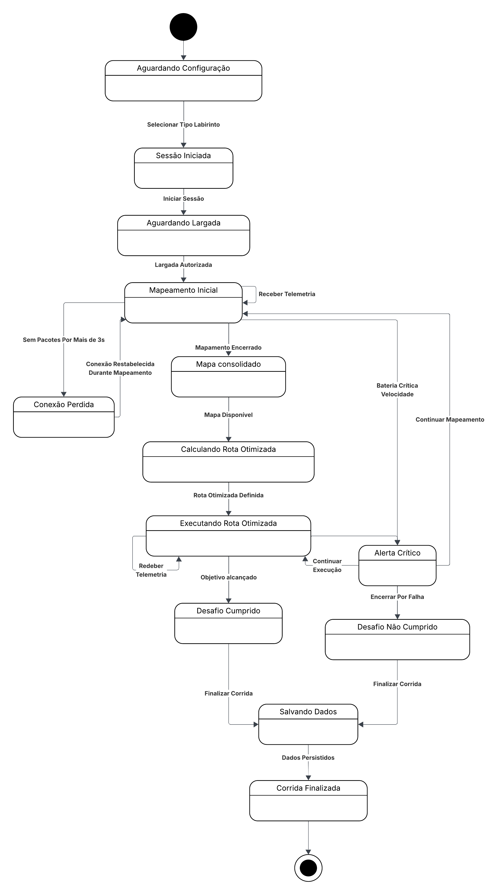
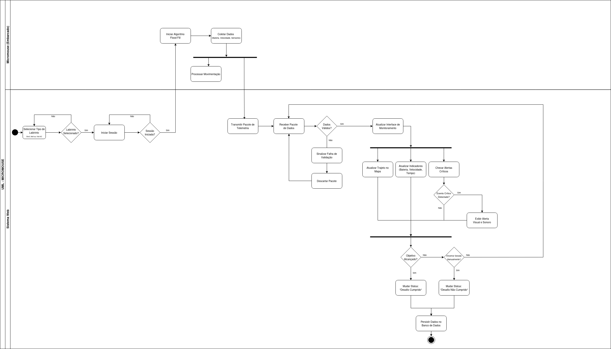
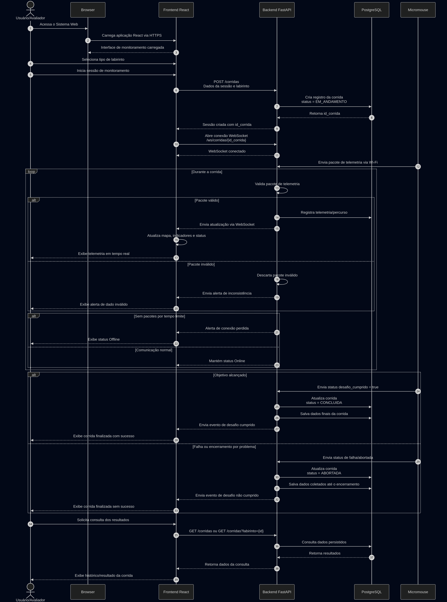
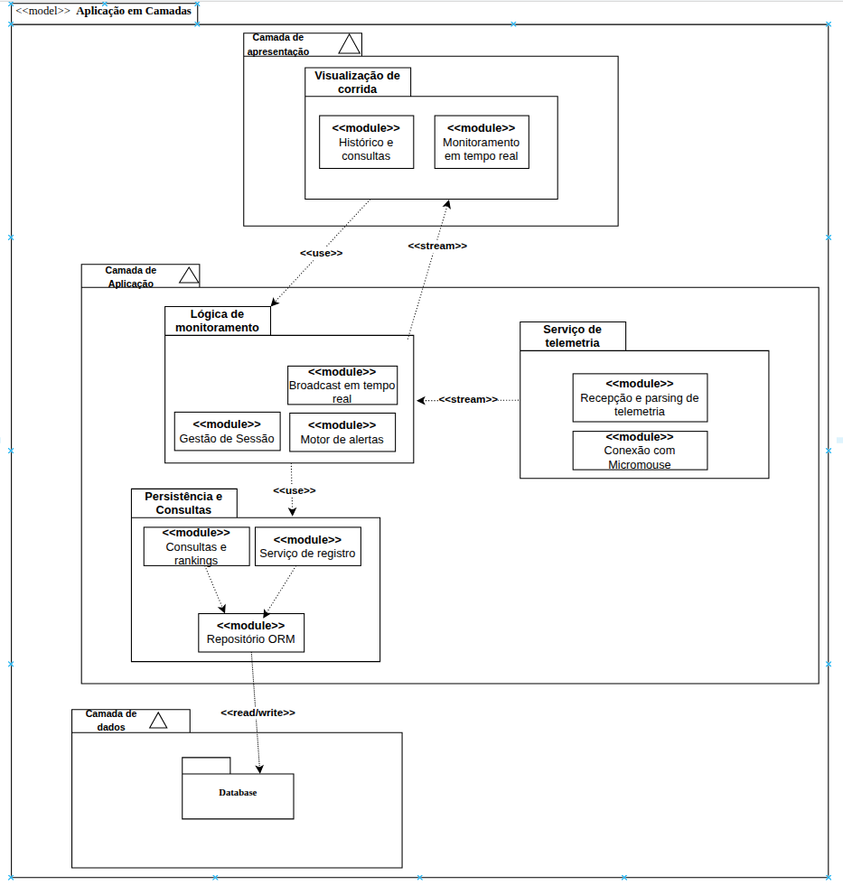
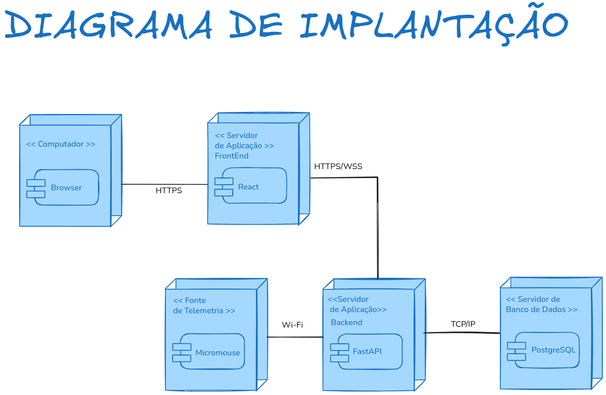
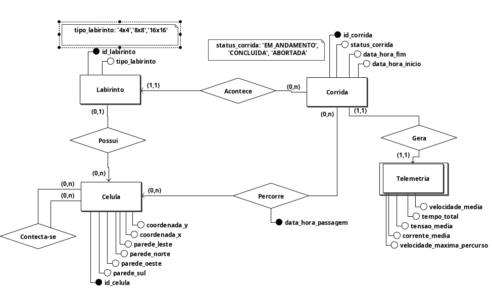
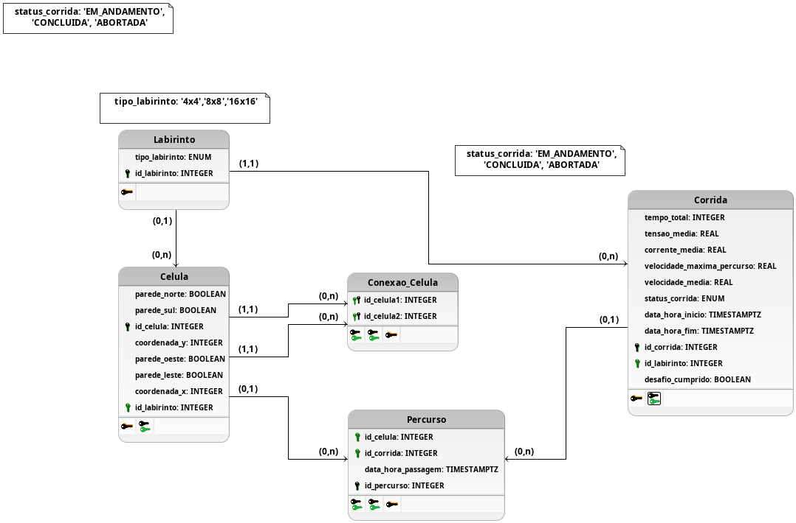

# Arquitetura de Software

## 1. Visão Geral

O Sistema Web do Micromouse tem como objetivo apoiar o monitoramento, armazenamento e análise dos dados gerados durante as corridas do robô. A solução de software será responsável por receber os dados de telemetria enviados pelo Micromouse, exibir as informações em tempo real, persistir os resultados das execuções e permitir consultas posteriores por labirinto ou de forma geral.

A arquitetura proposta utiliza uma estrutura simples e adequada ao escopo do projeto, separando as responsabilidades entre interface web, backend, comunicação em tempo real e banco de dados relacional.

---

## 2. Propósito do Software

O software tem o papel de atuar como camada de apoio ao sistema físico do Micromouse, permitindo que os dados da corrida sejam visualizados, registrados e analisados.

As principais responsabilidades do sistema são:

- receber dados de telemetria do Micromouse;
- validar os dados recebidos;
- exibir informações da corrida em tempo real;
- mostrar indicadores como trajeto, bateria, velocidade média, tempo e status do desafio;
- persistir os dados finais da execução;
- permitir consulta por labirinto;
- permitir consulta geral dos resultados.

---

## 3. Padrão Arquitetural Adotado

A solução adota uma arquitetura **monolítica em camadas**, separando as responsabilidades de interface, aplicação/API, comunicação em tempo real e persistência de dados. Essa estrutura está dividida em:

- **Camada de Apresentação:** interface web desenvolvida em React;
- **Camada de Aplicação/API:** backend desenvolvido em FastAPI;
- **Camada de Persistência:** banco de dados relacional PostgreSQL;
- **Camada de Comunicação em Tempo Real:** uso de WebSocket para atualização da telemetria.

Essa escolha foi feita por ser mais simples, adequada ao escopo acadêmico do projeto e compatível com o prazo da disciplina. Além disso, uma arquitetura monolítica em camadas é suficiente para atender aos requisitos de telemetria, monitoramento, armazenamento e consulta de resultados.

Não foram adotadas alternativas mais complexas, como microsserviços, pois destacamos que elas aumentariam a complexidade de implantação, comunicação e manutenção sem necessidade para o tamanho atual da solução.

---

## 4. Tecnologias Escolhidas

### 4.1 Linguagens de Programação

| Camada | Linguagem |
|---|---|
| Frontend | JavaScript |
| Backend | Python |
| Banco de Dados | SQL |

---

### 4.2 Frameworks e Bibliotecas

| Tecnologia | Uso no Projeto |
|---|---|
| React | Construção da interface web do sistema |
| FastAPI | Construção da API backend |
| WebSocket | Comunicação em tempo real entre backend e frontend |
| PostgreSQL | Persistência dos dados das corridas |
| Uvicorn/ASGI | Execução da aplicação FastAPI |

---

## 5. Organização Geral da Solução

A solução é composta pelos seguintes elementos principais:

- **Micromouse:** fonte dos dados de telemetria;
- **Frontend Web:** interface de monitoramento e consulta;
- **Backend:** responsável por receber, validar, processar e disponibilizar os dados;
- **WebSocket:** canal de comunicação para atualização em tempo real;
- **Banco de Dados:** armazenamento das informações das corridas.

O fluxo principal do sistema ocorre da seguinte forma:

1. O Micromouse envia dados de telemetria ao backend.
2. O backend valida e processa os dados recebidos.
3. Os dados são enviados em tempo real para o frontend por meio de WebSocket.
4. A interface web exibe os dados da corrida ao usuário.
5. Ao final da corrida, os dados são persistidos no banco.
6. O usuário pode consultar resultados históricos por labirinto ou de forma geral.

---

## 6. Visões Arquiteturais

A arquitetura do sistema será documentada considerando as visões do modelo **4+1**, adaptado para o contexto do projeto. Neste trabalho, a visão de casos de uso será substituída pela **visão de dados**, conforme orientação da disciplina.

---

### 6.1 Visão Lógica

A visão lógica descreve os principais módulos da solução de software e suas responsabilidades.

Os módulos principais são:

- **Interface Web:** exibe dados de monitoramento e telas de consulta;
- **Módulo de Telemetria:** recebe e valida os dados enviados pelo Micromouse;
- **Módulo de Monitoramento:** atualiza a interface em tempo real;
- **Módulo de Persistência:** armazena os dados finais das corridas;
- **Módulo de Consulta:** permite visualizar resultados históricos.

### 6.1.1 Comportamento Dinâmico (Diagrama de Estados)

O comportamento do sistema durante o ciclo de uma corrida é regido por estados que garantem a integridade da telemetria e o controle da sessão. O fluxo transita desde a configuração inicial até o salvamento final dos dados no PostgreSQL.

Ele contempla estados como:

- aguardando configuração;
- sessão iniciada;
- aguardando largada;
- mapeamento inicial;
- conexão perdida;
- mapa consolidado;
- cálculo de rota otimizada;
- execução da rota otimizada;
- alerta crítico;
- desafio cumprido;
- desafio não cumprido;
- salvamento dos dados;
- corrida finalizada.

Esse diagrama auxilia na compreensão do comportamento dinâmico do sistema e dos eventos que provocam transições entre estados.

  <em>Figura 2: Diagrama de Estados</em>

Autor: <a href="https://github.com/Potatoyz908">Euller</a>

### 6.1.2 Fluxo Operacional (Diagrama de Atividades UML)

O Diagrama de Atividades detalha o comportamento funcional e a coordenação entre o sistema embarcado e a interface de monitoramento, evidenciando a lógica de controle e o processamento de dados.

#### Estrutura do Diagrama

O fluxo utiliza **Raias (swimlanes)** para delimitar as responsabilidades entre os dois atores principais:

*   **Micromouse (Embarcado):** Responsável pela execução do algoritmo de navegação (Flood Fill), coleta de dados sensoriais (bateria, velocidade, sensores) e transmissão de telemetria.
*   **Sistema Web:** Responsável pela orquestração da sessão, validação de pacotes, interface de usuário e persistência de dados no PostgreSQL.

#### Descrição Detalhada das Atividades

1.  **Início e Decisão de Sessão:** O processo inicia no Sistema Web com a seleção do tipo de labirinto. Um **nó de decisão** garante que a sessão só avance se o labirinto for selecionado e a sessão iniciada corretamente.

2.  **Paralelismo no Micromouse:** Após o sinal de início, o robô utiliza uma **barra de bifurcação (fork)** para executar simultaneamente a coleta de dados e o processamento de movimentação.

3.  **Ciclo de Telemetria (Insumos e Resultados):**
    *   **Entrada:** Pacotes de telemetria transmitidos via Bluetooth/Wi-Fi.
    *   **Processamento:** O Sistema Web recebe e valida os pacotes. Caso sejam inválidos (**nó de decisão**), o pacote é descartado com a respectiva sinalização de falha de validação.

4.  **Sincronização e Atualização:** Se os dados forem válidos, o fluxo utiliza uma nova **barra de bifurcação** para atualizar simultaneamente o trajeto no mapa, os indicadores de performance e a checagem de alertas críticos (visuais e sonoros).

5.  **Pontos de Controle e Encerramento:**
    *   O sistema monitora continuamente, através de nós de decisão, se o **Objetivo foi alcançado** ou se houve um **Encerramento Manual** da sessão.
    *   **Saída Final:** Dependendo do desfecho, o status da corrida é alterado para "Desafio Cumprido" ou "Desafio Não Cumprido".
    *   A persistência automática dos dados ocorre no Banco de Dados antes de o fluxo convergir para o **estado final**.

  <em>Figura 3: Diagrama de Atividades UML</em>

Autor: <a href="https://github.com/dudaa28">Maria Eduarda</a>

---

### 6.2 Visão de Processos

A visão de processos descreve o comportamento dinâmico do sistema durante uma corrida. O foco aqui é a comunicação, a sincronização e o fluxo de dados entre os componentes em tempo real.

O sistema inicia aguardando a configuração da sessão. Após a seleção do labirinto e início da corrida, passa a receber telemetria, atualizar a interface em tempo real e acompanhar o estado da execução. Ao final da corrida, o sistema salva os dados e encerra a sessão. Também são considerados estados de exceção, como perda de conexão, alerta crítico, desafio não cumprido e falha na execução.

#### 6.2.1 Diagrama de Sequência: Ciclo de Vida da Corrida e Telemetria

  <em>Figura 1: Fluxo de comunicação entre Micromouse, Backend FastAPI e Frontend React.</em>

  Autores: 
  <a href="https://github.com/Potatoyz908">Euller</a> e 
  <a href="https://github.com/dudaa28">Maria Eduarda</a>

#### 6.2.2 Descrição dos Componentes e Fluxos

*   **Sincronização via WebSockets:** O uso de WebSockets entre o **Frontend React** e o **Backend FastAPI** permite a atualização reativa do mapa e dos indicadores de desempenho (bateria e velocidade) com baixa latência, eliminando a necessidade de *polling* constante.
*   **Validação e Resiliência (HU-09 e HU-10):** O backend atua como um filtro de integridade. Pacotes com campos ausentes ou formatos inválidos são descartados para evitar a poluição do banco de dados **PostgreSQL**. O monitoramento de *timeout* (3 segundos) garante que o avaliador seja notificado imediatamente sobre instabilidades na conexão Wi-Fi.
*   **Persistência Automática (HU-16):** Independente do sucesso no labirinto, o sistema garante a persistência do trajeto percorrido e dos eventos críticos, permitindo que a equipe realize a análise pós-corrida mesmo em casos de falha do robô.

---

### 6.3 Visão de Implementação

A visão de implementação descreve como o software será organizado em termos de tecnologias e componentes.

A implementação será dividida em:

- **Frontend React:** responsável pela interface do usuário;
- **Backend FastAPI:** responsável pela API, regras de processamento, validação e comunicação em tempo real;
- **Banco PostgreSQL:** responsável pela persistência dos dados estruturados;
- **WebSocket:** responsável pela atualização em tempo real dos dados da corrida.

### 6.3.1 Estrutura de Camadas e Pacotes (Diagrama de Pacotes)

O diagrama a seguir apresenta a organização do sistema em camadas (Apresentação, Aplicação e Dados) e os respectivos pacotes/módulos que compõem cada uma delas, detalhando a estrutura lógica descrita acima.

  <em>Figura: Diagrama de Pacotes</em>

Autor: <a href="https://github.com/GabrielCastelo-31">Gabriel Castelo</a>

### 6.4 Visão de Implantação

A visão de implantação apresenta os nós de execução da solução e a comunicação entre eles.

Os principais nós são:

- **Computador do Usuário:** executa o navegador;
- **Servidor Frontend:** disponibiliza a aplicação React;
- **Servidor Backend:** executa a aplicação FastAPI;
- **Fonte de Telemetria:** representa o Micromouse;
- **Servidor de Banco de Dados:** executa o PostgreSQL.

A comunicação entre os nós ocorre por meio dos seguintes protocolos:

- **HTTPS:** comunicação entre navegador e frontend;
- **HTTPS/REST:** comunicação tradicional entre frontend e backend;
- **WSS/WebSocket:** comunicação em tempo real entre frontend e backend;
- **Wi-Fi:** envio de telemetria do Micromouse ao backend;
- **TCP/IP:** comunicação entre backend e banco de dados.

#### Diagrama de Implantação

O diagrama de implantação apresenta uma visão física e tecnológica da solução. Ele mostra onde cada parte do sistema será executada e como os componentes se comunicam.

A arquitetura proposta considera que o usuário acessa o sistema por meio de um navegador. A interface web é desenvolvida em React e se comunica com o backend desenvolvido em FastAPI. O backend recebe os dados do Micromouse, processa a telemetria, envia atualizações em tempo real para o frontend via WebSocket e persiste os dados no PostgreSQL.

Autor: <a href="https://github.com/Potatoyz908">Euller</a>

---

### 6.5 Visão de Dados

A visão de dados descreve como as informações do sistema serão persistidas.

Como a solução utiliza um banco de dados relacional, foi utilizado um **Modelo Entidade-Relacionamento (MER)** e seu respectivo **Diagrama Entidade-Relacionamento (DER)**, além do diagrama lógico de dados(DLD).

#### 6.5.1 Modelo Entidade-Relacionamento (MER)

**IDENTIFICAÇÃO DAS ENTIDADES**

- **LABIRINTO**
- **CELULA**
- **CORRIDA**
- **TELEMETRIA**

**DESCRIÇÃO DAS ENTIDADES (ATRIBUTOS)**

- **LABIRINTO** (**id_labirinto**, tipo_labirinto)
- **CELULA** (**id_celula**, coordenada_x, coordenada_y, parede_norte, parede_sul, parede_leste, parede_oeste, id_labirinto)
- **CORRIDA** (**id_corrida**, desafio_cumprido, status_corrida, data_hora_inicio, data_hora_fim, id_labirinto)
- **TELEMETRIA** (velocidade_media, tempo_total, tensao_media, corrente_media, velocidade_maxima_percurso, id_corrida)

#### 6.5.2 Diagrama Entidade-Relacionamento (DER)

Autores: <a href="https://github.com/GabrielCastelo-31">Gabriel Castelo</a> e <a href="https://github.com/mtsmgn0">Mateus Magno</a>

#### 6.5.3 Diagrama Lógico de Dados (DLD)

Autor: <a href="https://github.com/GabrielCastelo-31">Gabriel Castelo</a>

---

## 7. Justificativa da Stack

A stack foi escolhida considerando a familiaridade da equipe, a simplicidade de implementação e a adequação aos requisitos do projeto.

### React

O React foi escolhido para o frontend por permitir a construção de interfaces web interativas e componentizadas. Ele atende bem à necessidade de exibir dados de telemetria em tempo real e organizar telas de consulta.

### FastAPI

O FastAPI foi escolhido para o backend por ser um framework Python simples, eficiente e adequado para criação de APIs. Além disso, permite trabalhar com WebSocket, recurso importante para o monitoramento em tempo real.

### PostgreSQL

O PostgreSQL foi escolhido por ser um banco de dados relacional robusto e adequado para armazenar informações estruturadas, como labirintos, sessões de corrida e registros de telemetria.

### WebSocket

O WebSocket foi escolhido para permitir comunicação em tempo real entre backend e frontend. Dessa forma, os dados recebidos do Micromouse podem ser enviados imediatamente para a interface de monitoramento.

---

## 8. Relação com os Requisitos do Sistema

A arquitetura proposta atende aos principais requisitos da frente de software:

| Requisito                       | Atendimento na Arquitetura |
| ------------------------------- | -------------------------- |
| Receber dados do Micromouse     | Backend FastAPI            |
| Exibir telemetria em tempo real | React + WebSocket          |
| Exibir indicadores da corrida   | Interface Web              |
| Salvar dados finais             | FastAPI + PostgreSQL       |
| Consultar por labirinto         | API + Banco de Dados       |
| Consultar resultados gerais     | API + Banco de Dados       |
| Validar telemetria recebida     | Backend FastAPI            |

---

## 9. Considerações Finais

A arquitetura proposta busca equilibrar simplicidade, clareza e capacidade de atender aos requisitos do projeto. A separação entre frontend, backend e banco de dados facilita o desenvolvimento em equipe, enquanto o uso de WebSocket permite o monitoramento em tempo real necessário para acompanhar a corrida do Micromouse.

Essa estrutura também permite evolução futura, como melhorias na interface, novos filtros de consulta, exportação de dados e integração mais robusta com o sistema embarcado.

---

## 10. Histórico de Versões

|Versão|Data|Autor|Descrição|Revisor |
|---|---|---|---|---|
|1.0|03/05/2026|[Euller](https://github.com/Potatoyz908)|Criação do documento|[Gabriel Castelo](https://github.com/GabrielCastelo-31)|
|1.1|04/05/2026|[Euller](https://github.com/Potatoyz908)|Atualização dos diagramas e adição de mais informações|[Gabriel Castelo](https://github.com/GabrielCastelo-31)|
|1.2 | 04/05/2026|[Gabriel Castelo](https://github.com/GabrielCastelo-31) | Revisão do documento e adição do histórico de versão| [Maria Eduarda](https://github.com/dudaa28)
|1.3 | 04/05/2026|[Gabriel Castelo](https://github.com/GabrielCastelo-31) | Adição do MER e DER|[Maria Eduarda](https://github.com/dudaa28)
|1.4 | 04/05/2026|[Maria Eduarda](https://github.com/dudaa28) | Adição do diagrama de atividades UML| [Gabriel Castelo](https://github.com/GabrielCastelo-31)|
|1.4.1 | 05/05/2026|[Euller Júlio](https://github.com/Potatoyz908) | Correção no diagrama de implantação UML| [Gabriel Castelo](https://github.com/GabrielCastelo-31)|

|1.5 | 05/05/2026|[Gabriel Castelo](https://github.com/GabrielCastelo-31) | Adição do diagrama lógico de dados| [Euller Júlio](https://github.com/Potatoyz908)|
